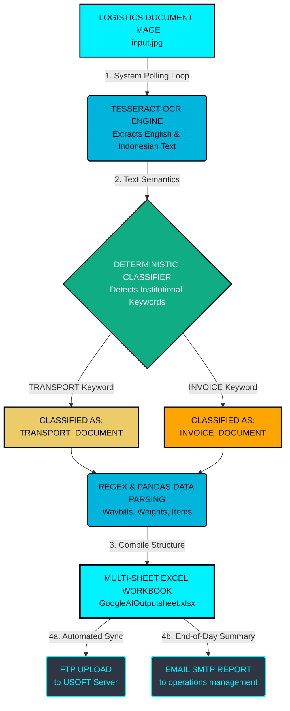

# Intelligent Logistics RPA Pipeline

### 🌐 Repository Address

```text
https://github.com/nightfurry325-code/ocr-logistics-rpa.git
```

---

## 🛠️ Project Architecture Diagram



---

## An automated RPA system built for **Proficient Cargo Services India LLP**.

This system processes incoming shipping documents via OCR, classifies them, and formats the data into structured multi-sheet Excel outputs.

### Installation (Linux Server)
1. **Install OCR & Dependencies:**
   ```bash
   sudo apt update
   sudo apt install tesseract-ocr tesseract-ocr-eng tesseract-ocr-ind python3 python3-pip -y
   ```
2. **Install Python Libraries:**
   ```bash
   pip3 install pandas openpyxl Pillow
   ```

### Executing the Program
Run the daemon loop:
```bash
python3 ocr_run.sh
```
*The script will poll the system dynamically every few minutes.*
