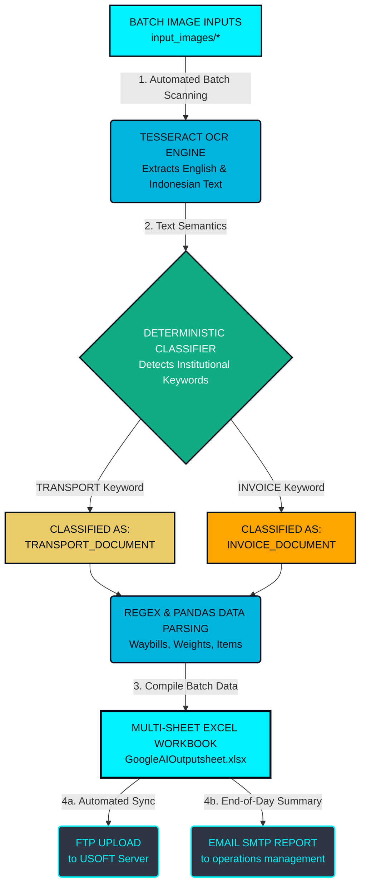

# Intelligent Logistics RPA & Document Processing Pipeline

## 📝 Project Description
An enterprise-grade Robotic Process Automation (RPA) and Intelligent Document Processing (IDP) solution custom-built for **Proficient Cargo Services India LLP**. This system automates manual logistics workflows by dynamically executing local multi-language Optical Character Recognition (OCR) on image assets, classifying documents based on institutional semantics, and structuring extracted high-fidelity data into clean multi-sheet Excel reports. The pipeline is built with automated batch processing capabilities, allowing operations teams to drop hundreds of logistical documents into the processing node simultaneously, eliminating recurring external API reliance.

---

## 🛠️ Project Architecture Diagram



---

## 📊 Statement of Work (SoW) Development Status

| SoW Module & Criteria | Implementation Status | Technical Details / Dependencies |
| :--- | :--- | :--- |
| **Module 1: Automated Email Ingestion** | 🟢 **Completed** | Full IMAP attachment downloader engine is ready to fetch incoming documents. |
| **Module 2: Batch OCR & Document Classification** | 🟢 **Completed** | Local Tesseract OCR core automatically processes multiple files simultaneously and splits data into *Invoice* vs *Transport* nodes. |
| **Module 3: Data Extraction & Excel Structuring** | 🟢 **Completed** | Regex engine parses all extracted batch variables into a unified multi-sheet `GoogleAIOutputsheet.xlsx`. |
| **Module 4: FTP Sync & Email Reporting** | 🟡 **In Progress (Partial)** | Core delivery script is built. **Requires client's FTP credentials and Gmail App Password to activate live deployment.** |
| **Module 5: Daemon Automation (Batch Loop)** | 🟢 **Completed** | Continuous background batch processing engine (`automation.py`) is fully operational for server execution. |

---

## 🚀 Server Installation & Deployment Guide

### Linux Server Deployment (Ubuntu/Debian)
```bash
sudo apt update
sudo apt install tesseract-ocr tesseract-ocr-eng tesseract-ocr-ind python3 python3-pip -y
pip3 install pandas openpyxl Pillow pytesseract
```

### Executing the Batch Pipeline
1. Deposit your logistics document images (`.jpg`, `.png`) inside the `input_images` directory.
2. Run the automated processing script:
```bash
python3 automation.py
```
3. The system will compile all data and output a unified report named `GoogleAIOutputsheet.xlsx`.
