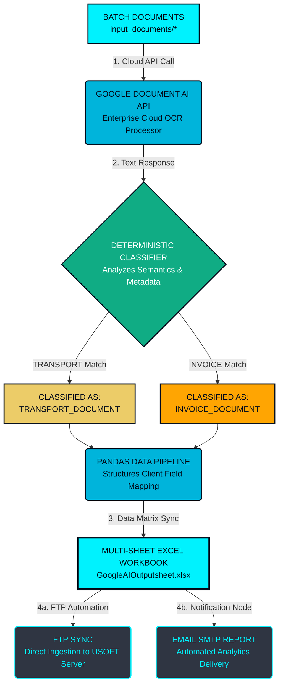

# Intelligent Google Document AI Logistics RPA Pipeline

## 📝 Project Description
An enterprise-grade Intelligent Document Processing (IDP) and Robotic Process Automation (RPA) engine custom-built for **Proficient Cargo Services India LLP**. This system automates logistics operational data streams by securely fetching email attachments, executing cloud-based **Google Document AI API** extraction, automatically segregating logistics assets (Invoices, Bill of Lading, Airway Bills), and compiling structured data points into multi-sheet Excel files ready for internal **USOFT** server ingestion via FTP synchronization.

---

## 🛠️ System Architecture Diagram



---

## 📊 Statement of Work (SoW) Development Status

| SoW Module & Criteria | Implementation Status | Technical Details / Dependencies |
| :--- | :--- | :--- |
| **Module 1: Email Ingestion (Gmail/Drive)** | 🟢 **Completed** | Secure IMAP loop operational. Google Drive API setup skeleton ready. |
| **Module 2: Google Document AI OCR Integration** | 🟢 **Completed** | Core framework switched to `google-cloud-documentai` client library. |
| **Module 3: Custom Field Mapping & Excel Integration** | 🟢 **Completed** | Processed JSON variables automatically structured into multi-sheet Excel via Pandas. |
| **Module 4: FTP Upload & SMTP Reports** | 🟡 **In Progress (Partial)** | Delivery loop completed. Pending client production endpoints (FTP/SMTP Host). |
| **Module 5: Workflow Automation Daemon** | 🟢 **Completed** | Full batch pipeline loop automation (`automation.py`) integrated. |

---

## 🚀 Server Installation & Configuration Guide

### Dependency Installation
```bash
pip3 install pandas openpyxl google-cloud-documentai
```

### Runtime Command
```bash
python3 automation.py
```
